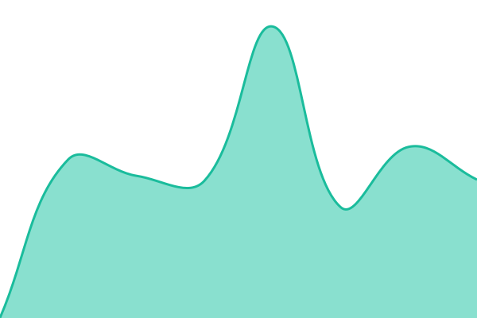

# [📈 Live Status](https://status.tianyibrad.com): <!--live status--> **🟩 All systems operational**

This repository contains the open-source uptime monitor and status page for [Tian Yi](https://www.tianyibrad.com), powered by [Upptime](https://github.com/upptime/upptime).

With [Upptime](https://upptime.js.org), you can get your own unlimited and free uptime monitor and status page, powered entirely by a GitHub repository. We use [Issues](https://github.com/BradleyBao/uptime/issues) as incident reports, [Actions](https://github.com/BradleyBao/uptime/actions) as uptime monitors, and [Pages](https://status.tianyibrad.com) for the status page.

<!--start: status pages-->
<!-- This summary is generated by Upptime (https://github.com/upptime/upptime) -->
<!-- Do not edit this manually, your changes will be overwritten -->
<!-- prettier-ignore -->
| URL | Status | History | Response Time | Uptime |
| --- | ------ | ------- | ------------- | ------ |
|  [Homepage](https://www.tianyibrad.com) | 🟩 Up | [homepage.yml](https://github.com/BradleyBao/uptime/commits/HEAD/history/homepage.yml) | 

 781ms
     
 | 

<a href="https://status.tianyibrad.com/history/homepage">100.00%</a>
    

|  [WhoAmI Portal](https://whoami.tianyibrad.com) | 🟩 Up | [who-am-i-portal.yml](https://github.com/BradleyBao/uptime/commits/HEAD/history/who-am-i-portal.yml) | 

 731ms
     
 | 

<a href="https://status.tianyibrad.com/history/who-am-i-portal">100.00%</a>
    

|  [DN42 Network Info](https://dn42.tianyibrad.com) | 🟩 Up | [dn-42-network-info.yml](https://github.com/BradleyBao/uptime/commits/HEAD/history/dn-42-network-info.yml) | 

 909ms
     
 | 

<a href="https://status.tianyibrad.com/history/dn-42-network-info">100.00%</a>
    

|  [Core API Services](https://api.tianyibrad.com/api/health) | 🟩 Up | [core-api-services.yml](https://github.com/BradleyBao/uptime/commits/HEAD/history/core-api-services.yml) | 

 828ms
     
 | 

<a href="https://status.tianyibrad.com/history/core-api-services">100.00%</a>
    

|  [NetSFC Campus Map API](https://netsfc-api.tianyibrad.com/api/health) | 🟩 Up | [net-sfc-campus-map-api.yml](https://github.com/BradleyBao/uptime/commits/HEAD/history/net-sfc-campus-map-api.yml) | 

 982ms
     
 | 

<a href="https://status.tianyibrad.com/history/net-sfc-campus-map-api">100.00%</a>
    

|  [Static Assets](https://images.tianyibrad.com) | 🟩 Up | [static-assets.yml](https://github.com/BradleyBao/uptime/commits/HEAD/history/static-assets.yml) | 

 921ms
     
 | 

<a href="https://status.tianyibrad.com/history/static-assets">100.00%</a>
    

<!--end: status pages-->

[**Visit our status website →**](https://status.tianyibrad.com)

## 📄 License

- Powered by: [Upptime](https://github.com/upptime/upptime)
- Code: [MIT](./LICENSE) © [Anand Chowdhary](https://anandchowdhary.com)
- Data in the `./history` directory: [Open Database License](https://opendatacommons.org/licenses/odbl/1-0/)
